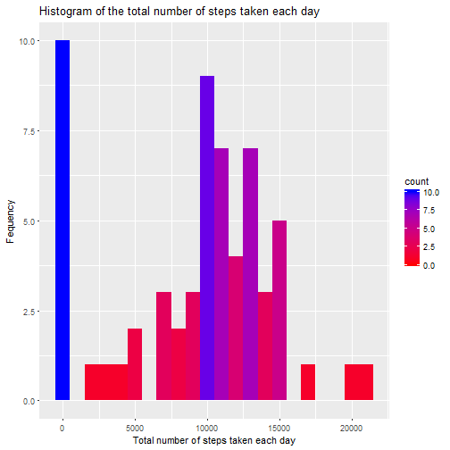
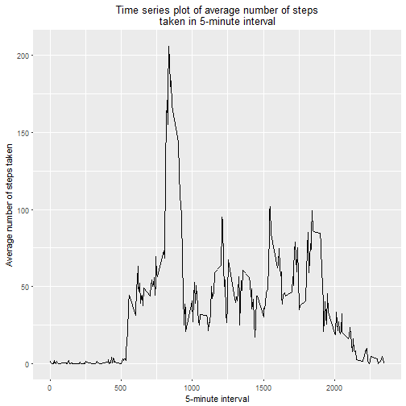
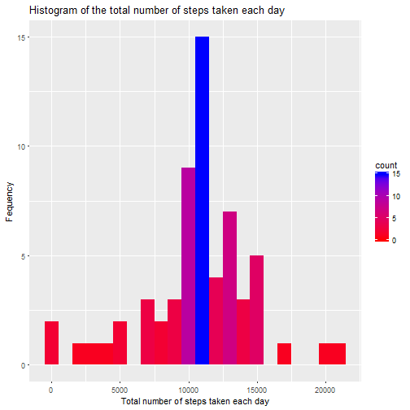
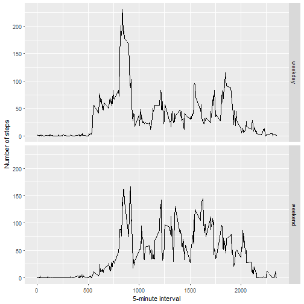

# Reproducible Research: Peer Assessment 1

## Loading and preprocessing the data

```r
unzip(zipfile="activity.zip")
data <- read.csv("activity.csv")
```

## What is mean total number of steps taken per day?

```r
library(ggplot2)
total.steps <- tapply(data$steps, data$date, FUN=sum, na.rm=TRUE)
h<-qplot( total.steps, geom="histogram",  binwidth=1000, fill=..count..,
      xlab="Total number of steps taken each day", 
      ylab='Fequency', 
      main = "Histogram of the total number of steps taken each day")
h+scale_fill_gradient(low="red", high="blue")
```



```r
mean(total.steps, na.rm=TRUE)
```

```
## [1] 9354.23
```

```r
median(total.steps, na.rm=TRUE)
```

```
## [1] 10395
```
Mean of total steps is 9354.23
Medium of total steps is 10395.

## What is the average daily activity pattern?

```r
library(ggplot2)
averages <- aggregate(x=list(steps=data$steps), by=list(interval=data$interval),
                      FUN=mean, na.rm=TRUE)
ggplot(data=averages, aes(x=interval, y=steps)) +
    geom_line() +
    xlab("5-minute interval") +
    ylab("Average number of steps taken")+
    ggtitle ( "Time series plot of average number of steps\ntaken in 5-minute interval")+
  theme(plot.title = element_text(hjust = 0.5))
```



Which 5-minute interval, on average across all the days in the dataset, contains the maximum number of steps?

```r
averages$interval[which.max(averages$steps)]
```

```
## [1] 835
```
The 5-minute interval that contains the maximum of steps, on average across all days, is 835.

## Imputing missing values

Note that there are a number of days/intervals where there are missing values (coded as NA). The presence of missing days may introduce bias into some calculations or summaries of the data.


```r
sum(is.na(data$steps))
```

```
## [1] 2304
```
There is 2304 missing values for steps in data.

All of the missing values are filled in with mean value for that 5-minute
interval.


```r
# Replace each missing value with the mean value of its 5-minute interval
fill.value <- function(steps, interval) {
    filled <- NA
    if (!is.na(steps))
        filled <- c(steps)
    else
        filled <- (averages[averages$interval==interval, "steps"])
    return(filled)
}
filled.data <- data
filled.data$steps <- mapply(fill.value, filled.data$steps, filled.data$interval)
```
Using the filled data set, let's make a histogram of the total number of steps taken taken each day and calculate and report the mean and median total number of steps per day.


```r
total.steps <- tapply(filled.data$steps, filled.data$date, FUN=sum)
h<-qplot( total.steps, geom="histogram",  binwidth=1000, fill=..count..,
      xlab="Total number of steps taken each day", 
      ylab='Fequency', 
      main = "Histogram of the total number of steps taken each day")
h+scale_fill_gradient(low="red", high="blue")
```



```r
mean(total.steps, na.rm=TRUE)
```

```
## [1] 10766.19
```

```r
median(total.steps, na.rm=TRUE)
```

```
## [1] 10766.19
```

Using the filled date, we get the same value of 10766 for mean and median.
These values are higher from the estimates from the first part of the assignment (mean is 9354.23,and medium is 10395). The impact of imputing the missing values is to have more data, hence to obtain a bigger mean and median value.

## Are there differences in activity patterns between weekdays and weekends?
First, we have to find the day of the week for each date in the dataset. In this part, we use the dataset with the filled-in values.
We adding new column day to indicate is each date a weekday or weekend.


```r
weekday.or.weekend <- function(date) {
  #setting english weekdays
  Sys.setlocale("LC_TIME", "English")
    day <- weekdays(date)
    if (day %in% c("Monday", "Tuesday", "Wednesday", "Thursday", "Friday"))
        return("weekday")
    else if (day %in% c("Saturday", "Sunday"))
        return("weekend")
    else
        return("invalid date")
}
filled.data$date <- as.Date(filled.data$date)
filled.data$day <- sapply(filled.data$date, FUN=weekday.or.weekend)
```

We meke a panel plot containing a time series plot (i.e. type = "l") of the 5-minute interval (x-axis) and the average number of steps taken, averaged across all weekday days or weekend days (y-axis).


```r
averages <- aggregate(steps ~ interval + day, data=filled.data, mean)
ggplot(averages, aes(interval, steps)) + geom_line() + facet_grid(day ~ .) +
    xlab("5-minute interval") + ylab("Number of steps")
```



There are some ifferences in activity patterns between weekdays and weekends - activity on weekdays is higher during the afternoon period (possible exercise after work etc.), while activity during weekends was higher throughout the day with no greater "peaks".

```r
knit2html("PA1_template.Rmd")
```

```
## 
## 
## processing file: PA1_template.Rmd
```

```
## Error in parse_block(g[-1], g[1], params.src): duplicate label 'loaddata'
```
